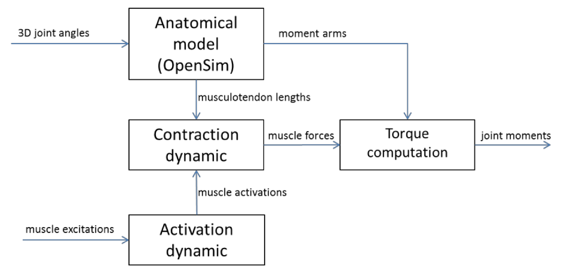
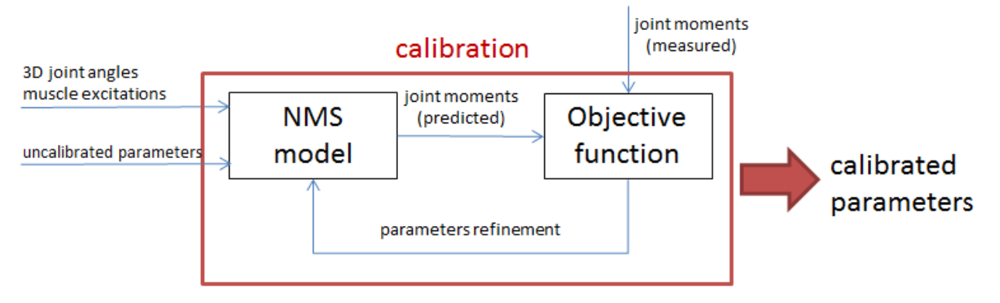
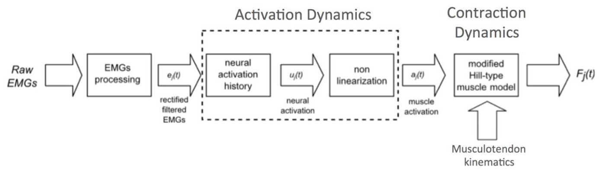

CEINMS
=======

.. _ceinmsOverview:

Overview
--------

CEINMS (Calibrated EMG-Informed Neuromusculoskeletal modelling toolbox) is the result of an interdisciplinary collaboration among the biomechanics and the computer science worlds.
Inspired by early electromyography-driven (EMG-driven) methods :cite:`hansen2006anatomy` used in the biomechanical community, Lloyd and colleagues developed algorithms and software to calibrate EMG-driven, or now called EMG-informed, neuromusculoskeletal models to match each individual's characteristics :cite:`buchanan2004neuromusculoskeletal,gerus2013subject,lloyd2003emg,lloyd1996model,lloyd2001strategies,lloyd2008neuromusculoskeletal,sartori2013hybrid,sartori2012emg,winby2013correlation,winby2009muscle`

Fundamental to these calibrated methods was the ability to validate the outputs against other data not used for calibration. All these algorithms and software were collected and integrated together to create CEINMS.

CEINMS was designed and written to be flexible and generic software, that is, given the appropriate anatomical and physiological data, it can operate with any number of musculotendon units (MTU) and any number of degree of freedoms (DOF). Moreover, the modular design allows the independent selection of different operation modes:

#. *Full-predictive open-loop mode.* The experimentally recorded EMG signals and 3D joint angles are used as input to a neuromusculoskeletal model to directly drive the computations of the musculotendon forces :cite:`gerus2013subject,lloyd2003emg,lloyd1996model,lloyd2001strategies,lloyd2008neuromusculoskeletal,sartori2012emg,winby2013correlation,winby2009muscle` (:num:`Fig. #figoverview`).
#. *Hybrid mode.* The excitation patterns of muscles from which it is not practical or possible to routinely collect EMG signals (e.g. deep muscles) are constructed using optimization algorithms. Then, the constructed excitations, experimental EMGs, and 3D joint angles are used as input for the neuromusculoskeletal model :cite:`sartori2013hybrid`.
#. *EMG-assisted mode.* This mode is a more generalizable form of the Hybrid mode. It uses optimization to adjust both the excitations determined from experimentally recorded EMG signals and to determine the excitations of muscles without experimental EMG. Then the muscle excitations, coupled with 3D joint angles, are used as input to the neuromusculoskeletal model.
#. *Full optimization-driven closed-loop mode.* In this mode, without the aid of experimental EMG data, an optimization algorithm is used to construct all the muscle excitations to drive the neuromusculoskeletal model :cite:`erdemir2007model,tsirakos1997inverse`.

Importantly, the different operation modes can be executed on the same neuromusculoskeletal model, allowing a consistent comparison among the different neural solutions. Fundamental to the current EMG-informed methods and the above modes of operation, CEINMS can be calibrated to the individual subject (:num:`Fig. #figcalibration`) :cite:`lloyd2003emg`. This is an optional operation procedure in CEINMS, which can therefore run in un-calibrated or calibrated state.

.. _figoverview:

   The schematic structure of CEINMS using the open-loop full predictive mode.

.. _introCalibration:

Calibration
~~~~~~~~~~~

The aim of calibration is to determine the values for a set of parameters for each musculotendon unit. The first parameter set defines the musculotendon unit's activation dynamics (see :ref:`introActivationDynamics` and :ref:`introNeuralToMuscle`), which characterise the transformation of muscle excitation to muscle activation. The second parameter set define the musculotendon contraction dynamics (:ref:`introContractionDynamics`), which transform the muscle activation and musculotendon kinematics into force :cite:`buchanan2004neuromusculoskeletal,gerus2013subject,lloyd2003emg,lloyd1996model,lloyd2001strategies,lloyd2008neuromusculoskeletal,sartori2013hybrid,sartori2012emg,winby2013correlation`. These parameters may change non-linearly across individuals, therefore an optimization algorithm, such as :ref:`simulated annealing <introSimAnnealing>` :cite:`goffe1994global`, is employed to alter the values of the parameters to enable close tracking of the experimental joint moments and/or excitations derived from EMG signals, which are acquired during the execution of different motor tasks :cite:`buchanan2004neuromusculoskeletal,gerus2013subject,lloyd2003emg,lloyd1996model,lloyd2001strategies,lloyd2008neuromusculoskeletal,sartori2013hybrid,sartori2012emg,winby2013correlation,winby2009muscle`. Various calibration control functions (e.g. minimize maximum activation, minimize maximum joint contact forces etc.) can also be implemented to direct the final set of model parameters :cite:`gerus2013subject,sartori2013hybrid`. Finally, during calibration, the parameters are also constrained to vary within predefined boundaries to ensure that the muscles operate in their physiological range.

The result of the calibration is a subject-specific neuromusculoskeletal (NMS) model, which reflects the musculotendon physiology, activation and contraction dynamics for an individual. Finally, CEINMS can be validated with a novel set of input data, which has not been used for the calibration process, and run with any of the four execution modes.

.. _figcalibration:

   Schematic representation of the calibration procedure implemented in CEINMS. The neuromusculoskeletal (NMS) model is started with an initial set of un-calibrated parameters taken from literature. The parameters are refined using an optimization algorithm to minimize the error between the estimated and the measured joint moments.

.. _introHybrid:

Hybrid mode
~~~~~~~~~~~~

Except for *full-predictive open-loop* mode, the operation modes require the solution of an optimization problem. For all problems, the objective function is defined as:

.. math::

    F_{obj} = \alpha*\sum_{k \in DOFs}(\tau_k-\tilde{\tau_k})^2+\beta*\sum_{j \in MTUs}(e_j-\tilde{e_j})^2+\gamma*\sum_{j \in MTUs}(e_j^2)

where :math:`\tau_k` is the moment at joint :math:`k` as estimated by CEINMS, :math:`\tilde{\tau_k}` is the experimental moment at joint :math:`k`, :math:`e_j` is the estimated excitation for MTU :math:`j`, and :math:`\tilde{e_j}` is the experimental excitation for MTU :math:`j`.

Changing the weight ratios :math:`\alpha, \beta, \gamma` of the objective function will result in different behaviours, seamlessy shifting from static optimization to EMG-assisted mode (see :ref:`using_ceinms`).

.. _introNMSmodels:

Neuromusculoskeletal models used in CEINMS
------------------------------------------

What follows is a description of all the various EMG-informed models that have been included in CEINMS. CEINMS implements two different models of the activation dynamics, which convert the neural drive to the muscle activation :cite:`zajac1988muscle`, and three models of the muscle contraction dynamics, which represent the transformation between the muscle activation  and muscle kinematics into force (:num:`Fig. #processingflow`).

.. _processingflow:

   General data processing flow showing activation dynamics and contraction dynamics.

.. _introActivationDynamics:

Activation dynamics
~~~~~~~~~~~~~~~~~~~

Muscle excitation signals :math:`e(t)` represent the neural drive to the muscles and are commonly extracted from experimental EMG signals. Typically, raw EMG signals are first high-pass filtered using a zero-lag fourth-order recursive Butterworth filter (30 Hz), then full wave rectified, and finally filtered using a Butterworth low-pass filter with a 6 Hz cutoff frequency. CEINMS software uses muscle excitation as input signals (see :ref:`prepareDataInputData`).

Neural activation is derived from muscle excitation by modelling the muscle’s twitch response in the activation dynamic model, which has been shown to improve muscle force predictions :cite:`buchanan2004neuromusculoskeletal,lloyd2003emg,lloyd2008neuromusculoskeletal`. This is represented by a critically damped linear second-order differential system :cite:`milner1973changes`, expressed in a discrete form by using backward differences :cite:`buchanan2004neuromusculoskeletal,lloyd2003emg,lloyd2008neuromusculoskeletal`.

.. math:: u_j(t) = \alpha e_j(t-d) - \beta_1 u_j(t-1) -\beta_2 u_j(t-2)
   :label: neuralactivation

where :math:`e_j(t)` is the :math:`j`-th muscle excitation at time :math:`t`, :math:`u_j(t)` is the neural activation, :math:`\alpha` is the muscle gain coefficient, :math:`\beta_1` and :math:`\beta_2` are the recursive coefficients, and :math:`d` is the electromechanical delay. A stable solution for this is obtained including the following constraints :cite:`buchanan2004neuromusculoskeletal,lloyd2003emg`

.. math::

   \beta_1 &= C_1 + C_2 \\
   \beta_2 &= C_1 \cdot C_2

where:

.. math::

   |C_1| < 1\\
   |C_2| < 1

and

.. math::

   \alpha - \beta_1 - \beta_2 = 1

.. _introNeuralToMuscle:

Neural activation to muscle activation
**************************************

The relation between neural activation and the muscle activation is non-linear, and CEINMS has two different solutions :cite:`buchanan2004neuromusculoskeletal,lloyd2003emg,manal2003one`. The first was introduced by :cite:`lloyd2003emg`,

.. math:: a_j(t)=\frac{e^{A_ju_j(t)}-1}{e^{A_j}-1}
   :label: muscleactivation1

where :math:`a_j(t)` is the activation of the :math:`j`-th muscle, and :math:`A_j` is the non-linear shape factor, constrained in the interval :math:`(-3, 0)`.

The second model was introduced and described by :cite:`manal2003one`. The :math:`u_j \rightarrow a_j` transformation is defined as a piecewise parametric function.

.. math:: a_j(t) &= \alpha_j^{act} ln(\beta_j^{act}u_j(t)+1), 0 \leq u_j(t)	\le u_0 \\ a_j(t) &= m_j u_j(t) + c_j, u_0 \leq u_j(t) \leq 1
   :label: muscleactivation2

For each muscle :math:`j`, the parameters :math:`\alpha_j^{act}`,  :math:`\beta_j^{act}`, :math:`m_j`, :math:`c_j` depend only on the shape factor :math:`A_j`, constrained in the interval :math:`(0, 0.12]`.

.. _introContractionDynamics:

Contraction dynamics
~~~~~~~~~~~~~~~~~~~~

Musculotendon kinematics and muscle activation (:num:`Fig. #processingflow`) are used as input for a modified Hill-type muscle model, which consists of an active force generating component, the muscle fibres, in series with a passive one, the tendon. The muscle fibre force depends on three main factors: :math:`f_a(\widetilde{l}_m)` is the active force-length relation that expresses the ability of muscle fibres to produce force at different lengths; :math:`f_p(\widetilde{l}_m)` is the passive force-length relation that represents the force response of the fibres to strain; and finally, :math:`f_v(\widetilde{v}_m)`  accounts for the force contribution of the fibres contraction velocity. These curves, represented in :num:`Fig. #forcelengthcurves` -a,b, are normalised to maximum isometric muscle force (:math:`F^{max}`), to optimal fibre length (:math:`L_m^0` ) for a), and maximum muscle contraction velocity (:math:`v^{max}`) for b).
The optimal fibre length decreases as the activation increases, and this interaction is considered in the computation of the active force :cite:`huijing1995important`: curves for different levels of activation are shown, with :math:`1.0` being :math:`100\%` activation. The force (:math:`F^{mt}`) produced by the musculotendon unit (MTU) is a function of muscle activation and muscle kinematics:

.. math:: F^{mt} = F^t = F^{max}[f_a(\widetilde{l}_m) \cdot f_v(\widetilde{v}_m) \cdot a + f_p(\widetilde{l}_m) + d_m \cdot \widetilde{v}_m] \cdot \cos \varphi
   :label: force

where :math:`F^t` is the tendon force, :math:`a` is the muscle activation, :math:`d_m` is the muscle damping element, and :math:`\varphi`  is the pennation angle of the fibres, which is function of the instantaneous fibre length :math:`l_m`

.. math:: \varphi = \sin^{-1}(\frac{L_m^0 \sin \varphi_0}{l_m})
   :label: pennationangle

where :math:`\varphi_0` is the pennation angle of the fibres at their optimal length.
The tendon element influences the estimation of the fibre length, i.e.

.. math:: l_m = \frac{l_{mt}-l_t}{\cos \varphi}
   :label: fiberlength

.. _forcelengthcurves:

.. figure:: ../images/forceLengthCurves.png
   :align: center
   :width: 50%
   :alt: Active and passive force length curves
   :figclass: align-center

   Active and passive force length curves. Values are normalised by :math:`F^{max}` and :math:`L_m^0` with :math:`1.0` being :math:`100\%` activation. Optimal muscle fibre length was scaled with activation by a relationship experimentally determined in :cite:`huijing1995important` (b) Normalised force-velocity relationship. Note the parallel damping element added to prevent singularities in the inverted force-velocity relationship :cite:`schutte1993using` when activation or isometric force equals :math:`0.0`. (c) Exponential tendon force-strain relationship

.. _introTendonModels:

Tendon models
*************

CEINMS includes three different tendon models to estimate MTU forces. In the first, the equations for the musculotendon force dynamics are solved by numerically integrating a set of ordinary differential equations. This *integration elastic tendon (IET)* model calculates the muscle fibre length by forward integration of the muscle fibre velocity. The starting value of fibre velocity :math:`v^m` is first estimated through an optimization routine, which distributes the total MTU velocity between fibres and tendon. :math:`v^m` is then integrated using a Runge-Kutta-Fehlberg algorithm to calculate first :math:`l_m` and :math:`l_t` then from equation :eq:`fiberlength`. The strain of the tendon is then calculated as

.. math:: \epsilon = \frac{l_t-l_{ts}}{l_t}
   :label: tendonstrain

where :math:`l_{ts}` is the slack length of the tendon. Then, :math:`F^t` is calculated using the force strain relation of the tendon (:num:`Fig. #forcelengthcurves`-c) and used with the activation to calculate the active and passive components of the force. Finally, :math:`v^m` is calculated inverting the force velocity function, and used as new value for the next integration step. Unfortunately :math:`F^{mt}` relies on the numerical integration of the stiff MTU equations and robust solutions are not always found.

A more robust implementation of the elastic tendon MTU model, which does not rely on forward integration, is the *equilibrium elastic tendon* (EET) model. The model uses a Van Wijngaarden-Dekker-Brent optimization routine to find the root of the equation

.. math:: F^{mt}(\widetilde{l}_m) = F^{t}(\widetilde{l}_m)
   :label: EET

where :math:`F^{t}(\widetilde{l}_m)` is obtained from the tendon force-strain relation expressing the tendon strain :math:`\epsilon` as a function of :math:`\widetilde{l}_m` by combination of equation :eq:`pennationangle`, equation :eq:`fiberlength`, and equation :eq:`tendonstrain`. :math:`F^{mt}(\widetilde{l}_m)` is obtained from equation :eq:`force`, calculating :math:`\widetilde{v}_m` as numerical derivative of :math:`\widetilde{l}_m`. This implementation provides a robust method for the solution of the fibre length, which, unlike the IET, always guarantees the equilibrium of the musculotendon unit.

The last tendon implementation is the *stiff tendon* (ST) model :cite:`sartori2010fast,sartori2012modeling`, which simplifies the tendon model in order to reduce the computation time. The tendon is considered as an element of infinite stiffness, with length equal to the slack length.

Although a complete comparison of the all proposed implementations of the elastic tendon is not yet available, the results of the two elastic tendon implementations have overlapping fibre length estimates (:num:`Fig. #forcelengthestimation` -a). However, when the length of the tendon is short compared to the total length of the musculotendon unit, the integration model may produce wrong results. For example when examining the fibre length of the gracilis muscle during the stance phase of a walking trial (:num:`Fig. #forcelengthestimation` -b), the fibre length calculated by the stiff tendon model (which presents a fixed tendon length) must always be greater than the one calculated using an elastic tendon. This is not the case for the integration elastic tendon model, which provides a wrong estimation of the fibre length. However, the equilibrium model has behaviour very close to the stiff model, which is compatible with the small ratio for :math:`l_{ts} /l_{mt}`.

.. _forcelengthestimation:

.. figure:: ../images/forceLengthEstimation.png
   :align: center
   :width: 50%
   :alt: Estimation of muscle fibre length using three different tendon models
   :figclass: align-center

   Estimation of muscle fibre length using three different tendon models. (a) The integration elastic tendon model (IET) and the equilibrium elastic tendon model (EET) produce the same estimation for the fibre length of the gastrocnemius medialis muscle. (b) The estimation of gracilis muscle fibre length given by IET and EET is different because of problems in the integration of the fibre velocity in the IET model. The fibre length estimated by IIT is greater than the one estimated by the stiff tendon model (ST), while the EET model has behaviour very close to the stiff model, which is compatible with the small ratio :math:`l_{ts} /l_{mt}`.

Appendices
----------

.. _introSimAnnealing:

Appendix A: Simulated Annealing
~~~~~~~~~~~~~~~~~~~~~~~~~~~~~~~~

In this section we present the simulated annealing algorithm proposed by :cite:`Corana:1987` and that we use for the calibration process.
Part of this section is an extract from :cite:`Goffe:1994`.

.. code-block:: none
    :linenos:

    X = X_0
    CALCULATE f(X)
    X_opt = X
    f_opt = f(X)

    DO UNTIL convergence
        DO NT times
            DO NS times
                DO k = 1, ... , n
                x'_k = x_k + r * v_k, r in [-1,1)
                CALCULATE f(X')
                IF f(X') < f(X) THEN
                    X = X'
                END IF
                IF f(X') >= f(X) THEN
                    apply Metropolis criteria
                    IF accepted: X = X'
                END IF
                IF f(X') > f_opt THEN
                    X_opt = X, f_opt = f(X_opt)
                END IF
            END DO
        END DO
        ADJUST V such half of all trials are accepted
    END DO
    X*_h =X
    increase h index
    IF |f(X*_l) - f_opt| < eps, for each l=h, h-1, ... , h-N_eps        THEN
        REPORT X_opt, f_opt, V
        STOP
    ELSE
        T=r_T ... T, reduce T
        X = X_opt, start at the current best optimum
    END IF
    CONTINUE

If ``f(X')`` is greater then or equal to ``f(X)``, the Metropolis criterion decides on acceptance (lines 15 - 16).
The value

.. math::   p=e^{\left(\mathit{f'}-\mathit{f}\right)/T}
    :label: transitionProbability

is computed and compared to ``p'``, a uniformly distributed random number from ``[0,1)``. If ``p`` is greater then ``p'``, the new point is accepted. ``X`` is updated with ``X`` and the algorithm moves uphill (line 17).
Otherwise, ``X'`` is rejected. Two factors decrease the probability of an uphill move: lower temperature
and larger differences in the function values.

Every ``NS`` steps through all the elements of ``X``, the step length vector ``V`` is 
adjusted so that half of all moves are accepted (line 24).
The goal is to sample the function widely. If a greater percentage of points are accepted for ``x_k``, then the 
relevant element of ``V`` is enlarged. For a given temperature, this increases the number of rejections and
decreases the percentage of acceptances. Every ``NT`` times through the above loops, the temperature ``T``
is reduced (line 32). The new temperature is given by

.. math::  T'=r_T \cdot T
    :label: newTemperature

where ``rT`` ranges in ``[0,1)``. A lower temperature makes a given uphill move less likely, so the number of rejections increases and the step lengths decline. After a change in the temperature, the ``X`` vector is reset to the current ``X_opt`` (line 33).
This selection of the starting point together with a smaller step focuses search efforts on the most promising area.

After the temperature reduction, we define ``X*_h=X`` where ``X`` is the vector used 
in the last function evaluation and ``h`` is increased every ``N_T`` times (lines 26 - 27).
The algorithm ends by comparing ``f(X*_l)`` with ``f_opt``, where ``l=h, h-1, ... , h-N_eps``. 
If all the ``N_eps`` differences are less then ``epsilon``, the algorithm terminates (lines 28 - 30). 
This criterion helps to ensure that global minimum is reached.

.. only:: html

    .. rubric:: Bibliography

.. bibliography:: literature.bib
    :cited:
