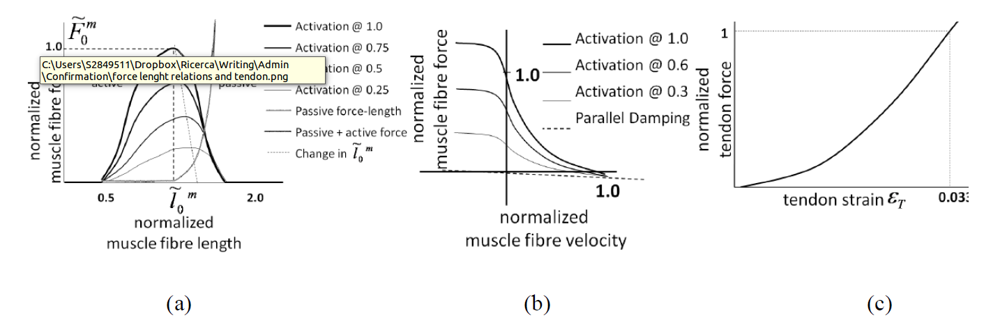
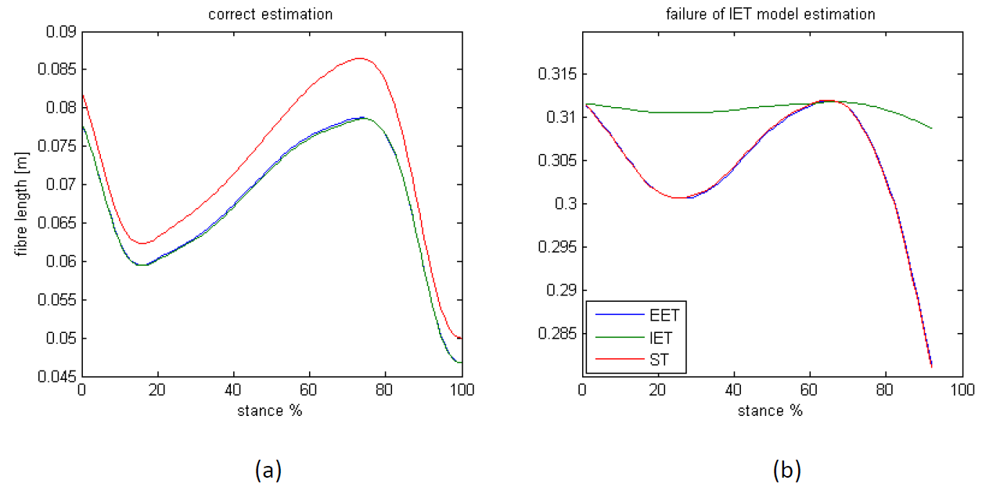

Contraction dynamics
====================

Musculotendon kinematics and muscle activation (:num:`Fig. #calibration`) are used as input for a modified Hill-type muscle model, which consists of an active force generating component, the muscle fibres, in series with a passive one, the tendon. The muscle fibre force depends on three main factors: (:math:`f_a(\widetilde{l}_m)`) is the active force-length relation that expresses the ability of muscle fibres to produce force at different lengths; (:math:`f_p(\widetilde{l}_m)`) is the passive force-length relation that represents the force response of the fibres to strain; and finally, :math:`f_v(\widetilde{v}_m)`  accounts for the force contribution of the fibres contraction velocity. These curves, represented in :num:`Fig. #forcelengthcurves` -a,b, are normalised to maximum isometric muscle force (:math:`F^{max}`), optimal fibre length (:math:`L_m^0` ), and maximum muscle contraction velocity (:math:`v^{max}`). The optimal fibre length decreases as the activation increases, and this interaction is considered in the computation of the active force. The force (:math:`F^{mt}`) produced by the musculotendon unit (MTU), is a function of muscle activation and muscle kinematics and is given by,

.. math::

  F^{mt} = F^t = F^{max}[f_a(\widetilde{l}_m) f_v(\widetilde{v}_m) a + f_p(\widetilde{l}_m) + d_m  \widetilde{v}_m]	 \cos \varphi

where :math:`F^t` is the tendon force, :math:`a` is the muscle activation, :math:`d_m` is the muscle damping element, and :math:`\varphi`  is the pennation angle of the fibres, which is function of the instantaneous fibre length (:math:l_m)

.. math::

   \varphi = \sin^{-1}(\frac{L_m^0 \sin \varphi_0}{l_m})

where :math:`\varphi_0` is the pennation angle of the fibres at their optimal length. The tendon element influences the estimation of the fibre length, i.e.

.. math::

   l_m = \frac{l_{mt}-l_t}{\cos \varphi}

.. _forcelengthcurves:

   Active and passive force length curves. Values are normalised by :math:`F^{max}` and :math:`L_m^0` with :math:`1.0` being :math:`100\%` activation. Optimal muscle fibre length was scaled with activation by a relationship experimentally determined in :cite:`huijing1995important` (b) Normalised force-velocity relationship. Note the parallel damping element added to prevent singularities in the inverted force-velocity relationship :cite:`schutte1993using` when activation or isometric force equals :math:`0.0`. (c) Exponential tendon force-strain relationship

CEINMS includes three different tendon models to estimate MTU forces. In the first, the equations for the musculotendon force dynamics are solved by numerically integrating a set of ordinary differential equations. This integration elastic tendon (IET) model calculates the muscle fibre length by forward integration of the muscle fibre velocity. The starting value of fibre velocity :math:`v^m` is first estimated through an optimization routine, which distribute the total MTU velocity between fibres and tendon. :math:`v^m` is then integrated using a Runge-Kutta-Fehlberg algorithm to calculate first :math:`l_m` and :math:`l_t` then from equation 1. The strain of the tendon is then calculated as

.. math::

	\epsilon = \frac{l_t-l_{ts}}{l_t}

where :math:`l_{ts}` is the slack length of the tendon. Then, :math:`F^t` is calculated using the force strain relation of the tendon (:num:`Fig. #forcelengthcurves`-c) and used with the activation to calculate the active and passive components of the force. Finally, :math:`v^m` is calculated inverting the force velocity function, and used as new value for the next integration step. Unfortunately :math:`F^{mt}` relies on the numerical integration of the stiff MTU equations and robust solutions are not always found.
A more robust implementation of the elastic tendon MTU model, which does not rely on forward integration, is the *equilibrium elastic tendon* (EET) model. The model uses a Van Wijngaarden-Dekker-Brent optimization routine to find the root of the equation

.. math::

   F^{mt}(\widetilde{l}_m) = F^{t}(\widetilde{l}_m)

Where :math:`F^{t}(\widetilde{l}_m)` is obtained from the tendon force-strain relation expressing the tendon strain :math:`\epsilon` as a function of :math:`\widetilde{l}_m` by combination of equation 5, equation 6, and equation 7.  :math:`F^{mt}(\widetilde{l}_m)` is obtained from equation 4, calculating :math:`\widetilde{v}_m` as numerical derivative of :math:`\widetilde{l}_m`. This implementation provides a robust method for the solution of the fibre length, which always guarantees the equilibrium of the musculotendon unit, which is not always guaranteed by the integration of the MTU dynamic equations.
The last tendon implementation is the *stiff tendon* (ST) model :cite:`sartori2010fast,sartori2012modeling`, which simplifies the tendon model in order to reduce the computation time. The tendon is considered as an element of infinite stiffness, with length equal to the slack length.

Although a complete comparison of the all proposed implementations of the elastic tendon is not yet available, the results of the two elastic tendon implementations have overlapping fibre length estimates (:num:`Fig. #forcelengthestimation` -a). However, when the length of the tendon is short compared to the total length of the musculotendon unit, the integration model may produce wrong results. For example when examining the fibre length of the gracilis muscle during the stance phase of a walking trial (:num:`Fig. #forcelengthestimation` -b), the stiff tendon model presents a fixed tendon length, and the fibre length calculated by the stiff model must always be greater than the one calculated using an elastic tendon. This is not the case for the integration elastic tendon model, which provides a wrong estimation of the fibre length. However, the equilibrium model has behaviour very close to the stiff model, which is compatible with the small ratio for :math:`\frac{l_{ts}}{l_{mt}}`.

.. _forcelengthestimation:

   Estimation of muscle fibre length using three different tendon models. (a) The integration elastic tendon model (IET) and the equilibrium elastic tendon model (EET) produce the same estimation for the fibre length of the gastrocnemius medialis muscle. (b) The estimation of IET and EET is different because of problems in the integration of the fibre velocity in the IET model. The fibre length estimated by IIT is greater than the one estimated by the stiff tendon model (ST), while the EET model has behaviour very close to the stiff model, which is compatible with the small ratio \u2044.
